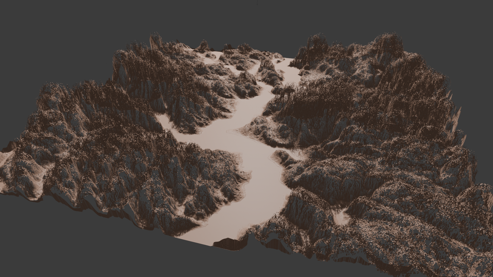
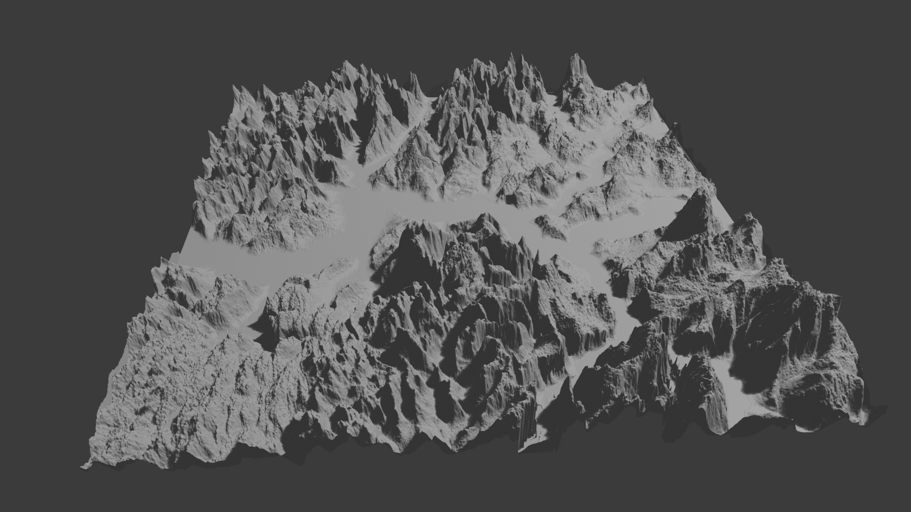
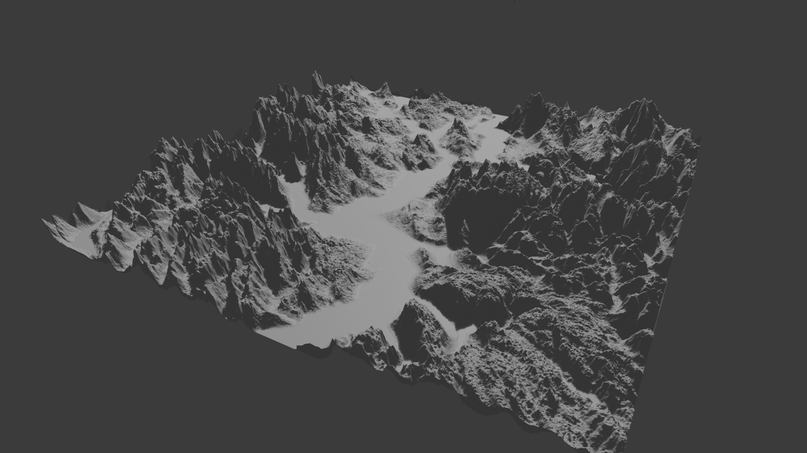
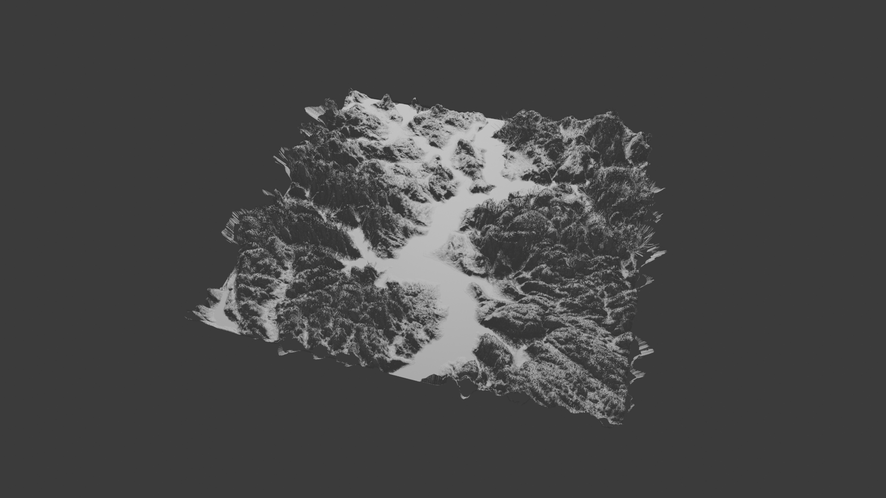
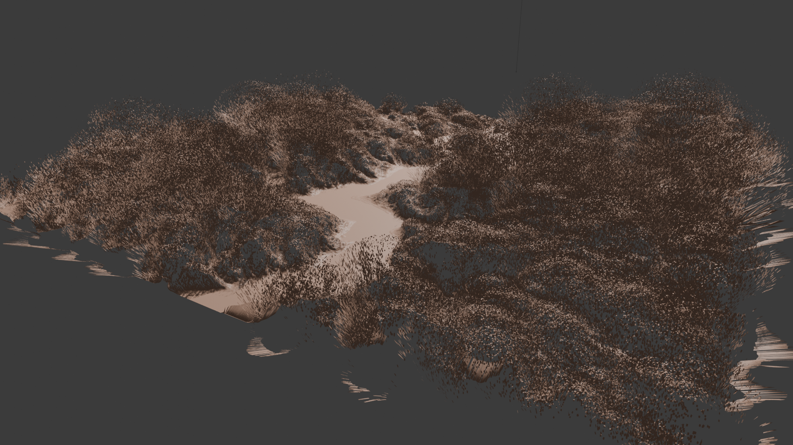
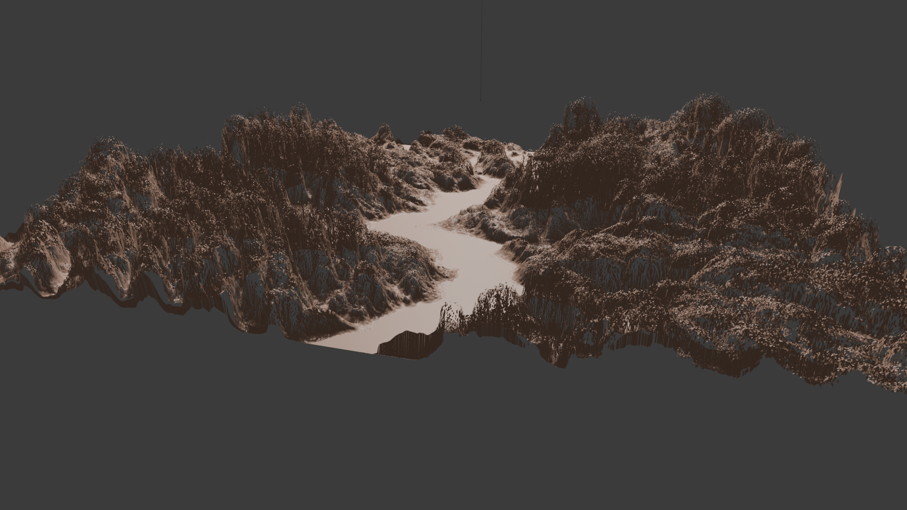
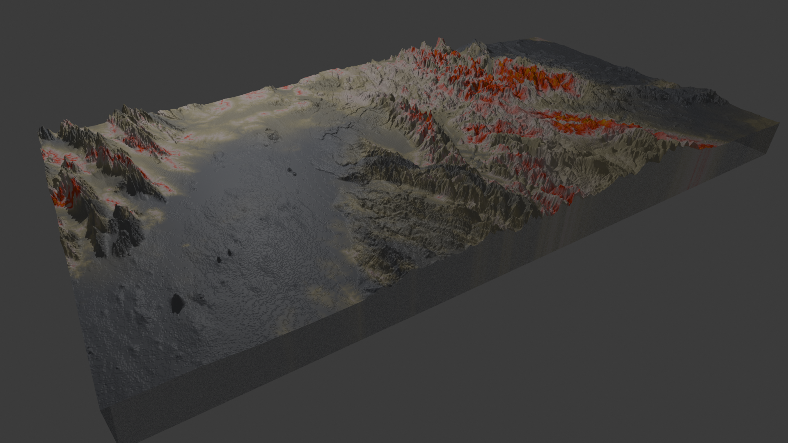

+++
title = 'Making 3D maps in Blender'
date = 2024-06-24T14:38:33+02:00
draft = false
type = 'blog'

[images]
    featured_image = 'images/render10'
+++

This post is about experimententing with Blender in conjunction with GIS geographic data (specifically, heightmaps) to create three dimmensional renderings of real terrain.

Welcome to the world of "Content Ipsum," the fresh alternative to the classic lorem ipsum. It's the perfect blend for designers and writers who crave a dash of creativity and meaning in their placeholder text. Imagine a text that not only fills the space but also sparks the imagination, a text that weaves tales of innovation, inspiration, and the endless possibilities that creativity brings.

In the realm of "Content Ipsum," every paragraph is a journey through the wonders of the human mind, a celebration of the achievements that have shaped our world, and a look into the future that awaits us. From the depths of the ocean to the farthest reaches of the universe, "Content Ipsum" takes you on an adventure that captivates and informs.

So, the next time you're crafting a design or drafting a document, let "Content Ipsum" infuse your work with the spirit of discovery and the joy of creation. It's more than just text; it's a narrative that connects, engages, and inspires. Welcome to the evolution of placeholder text – where every word is a story waiting to be told.

Welcome to the world of "Content Ipsum," the fresh alternative to the classic lorem ipsum. It's the perfect blend for designers and writers who crave a dash of creativity and meaning in their placeholder text. Imagine a text that not only fills the space but also sparks the imagination, a text that weaves tales of innovation, inspiration, and the endless possibilities that creativity brings.

In the realm of "Content Ipsum," every paragraph is a journey through the wonders of the human mind, a celebration of the achievements that have shaped our world, and a look into the future that awaits us. From the depths of the ocean to the farthest reaches of the universe, "Content Ipsum" takes you on an adventure that captivates and informs.

So, the next time you're crafting a design or drafting a document, let "Content Ipsum" infuse your work with the spirit of discovery and the joy of creation. It's more than just text; it's a narrative that connects, engages, and inspires. Welcome to the evolution of placeholder text – where every word is a story waiting to be told.
